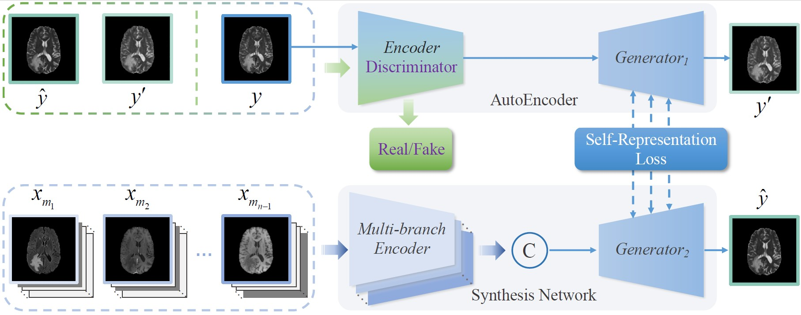
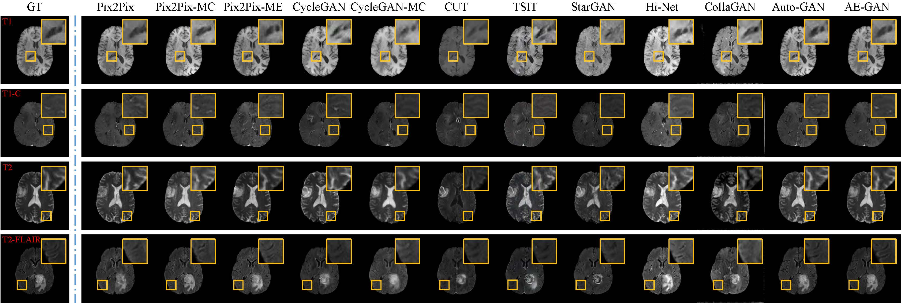
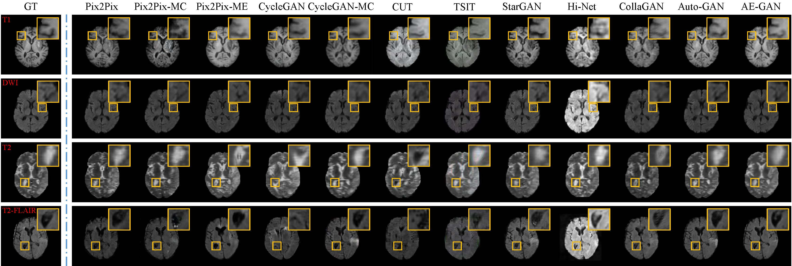
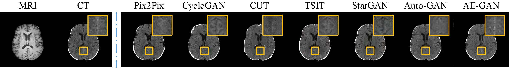

# AutoEncoder Driven Multimodal Collaborative Learning for Medical Image Synthesis

The PyTorch implements of **AutoEncoder Driven Multimodal Collaborative Learning for Medical Image Synthesis**.

**The overview of our AE-GAN framework.**



Our method can synthesis clear and nature images and outperforms other state-of-the-art methods on many datasets.

Experiment results on **BraTS2020** dataset.


Experiment results on **ISLES2015** dataset.


Experiment results on **CBMFM** dataset.


## Environment
```
python              3.8.10
pytorch             1.8.1
torchvision         0.9.1
tqdm                4.62.1
numpy               1.20.3
SimpleITK           2.1.0
scikit-learn        0.24.2
opencv-python       4.5.3.56
easydict            1.9
tensorboard         2.5.0
Pillow              8.3.1
```
## Datasets
Download the datasets from the official way and rearrange the files to the following structure.
The dataset path can be modified in the AE-GAN/options/\*.yaml file.
### BraTS2020
```
MICCAI_BraTS2020_TrainingData
├── flair
│   ├── BraTS20_Training_001_flair.nii.gz
│   ├── BraTS20_Training_002_flair.nii.gz
│   ├── BraTS20_Training_003_flair.nii.gz
│   ├── ...
├── t2
│   ├── BraTS20_Training_001_t2.nii.gz
│   ├── BraTS20_Training_002_t2.nii.gz
│   ├── BraTS20_Training_003_t2.nii.gz
│   ├── ...
├── t1
│   ├── BraTS20_Training_001_t1.nii.gz
│   ├── BraTS20_Training_002_t1.nii.gz
│   ├── BraTS20_Training_003_t1.nii.gz
│   ├── ...
├── t1ce
│   ├── BraTS20_Training_001_t1ce.nii.gz
│   ├── BraTS20_Training_002_t1ce.nii.gz
│   ├── BraTS20_Training_003_t1ce.nii.gz
│   ├── ...
```
### ISLES2015
```
SISS2015_Training
├── 1
│   ├── VSD.Brain.XX.O.MR_T2.70616
│        ├── VSD.Brain.XX.O.MR_T2.70616.nii
│   ├── VSD.Brain.XX.O.MR_T1.70615
│        ├── VSD.Brain.XX.O.MR_T1.70615.nii
│   ├── VSD.Brain.XX.O.MR_Flair.70614
│        ├── VSD.Brain.XX.O.MR_Flair.70614.nii
│   ├── VSD.Brain.XX.O.MR_DWI.70613
│        ├── VSD.Brain.XX.O.MR_DWI.70613.nii
├── 2
│   ├── VSD.Brain.XX.O.MR_T2.70622
│        ├── VSD.Brain.XX.O.MR_T2.70622.nii
│   ├── VSD.Brain.XX.O.MR_T1.70621
│        ├── VSD.Brain.XX.O.MR_T1.70621.nii
│   ├── VSD.Brain.XX.O.MR_Flair.70620
│        ├── VSD.Brain.XX.O.MR_Flair.70620.nii
│   ├── VSD.Brain.XX.O.MR_DWI.70619
│        ├── VSD.Brain.XX.O.MR_DWI.70619.nii
├── 3
│   ├── ...
```

## Train
Edit the .yaml file of the corresponding dataset for training configuration and run the following command to train.
```
python train.py options/brats.yaml
```

## Test
Edit the .yaml file of the corresponding dataset for testing configuration and run the following command to test.
```
python test.py options/brats.yaml
```
